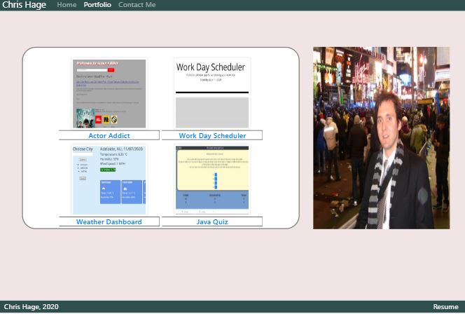

# About Me

* [About Me Website](https://github.com/AboutMe/)
* [About Me Repository](https://github.com/chages16/AboutMe)

My new updated mobile portfolio works now includes a list of projects and assignments created over the course of the Coding bootcamp. Changes have been made to the CSS and the Bootcamp structure so that it has more of a unique work, and to ensure greater functionality on mobile view. Javascript is used to display a randomised picture everytime a page is reloaded.

## User Story
As an aspiring coder, I want to be able to showcase my skills and projects so that I can increase my connections within the industry.

## Technology Used
**Server side APIs:**
* [Moment.js](https://momentjs.com/)

**CSS framework:**
* [Bootstrap](https://getbootstrap.com/)

**3rd party APIs:**
* [JQuery](https://api.jquery.com/)

## Challenges
I used the original [Mobile Portfolio](https://github.com/chages16/Bio) from earlier on in the course as my framework which caused some problems. The existing Mobile functionality was faulty, and pictures and information would disappear on smaller screens. I had to start the Portfolio page from scratch in order to adjust how the information was displayed, and changed the HTML so that it would look and act similar to the main page.

The mobile queries are still buggy. On smaller screens, the pictures do not appear in a straight line vertically down the screen. I've played with the media queries to try and fix this, however wasn't able to find the time to perfect it. For now, all projects are still accesable from a mobile phone, however I need to work on the way it displays.

I would have liked more time to refine my resume and Github profile. Over time this should be improved.

## Next Steps
I'd like to continue to work on the colour screen and the CSS to continue to make it look less like a Bootstrap template. More time on the media queries should help give the profile a more mobile-friendly appearance.

WIth more time I'd like to refine my resume. As I become more proficient with the foundations of Coding I should be able to adjust my resume accordingly.

## Future Development
* search for quotes, actors + directors
* include musicians and search for music lyrics
* make giphy results more specific
* carosel for images of the film/actor/musician

## Credits
**Collaborators:**
* [Chris Hage](https://github.com/chages16)
